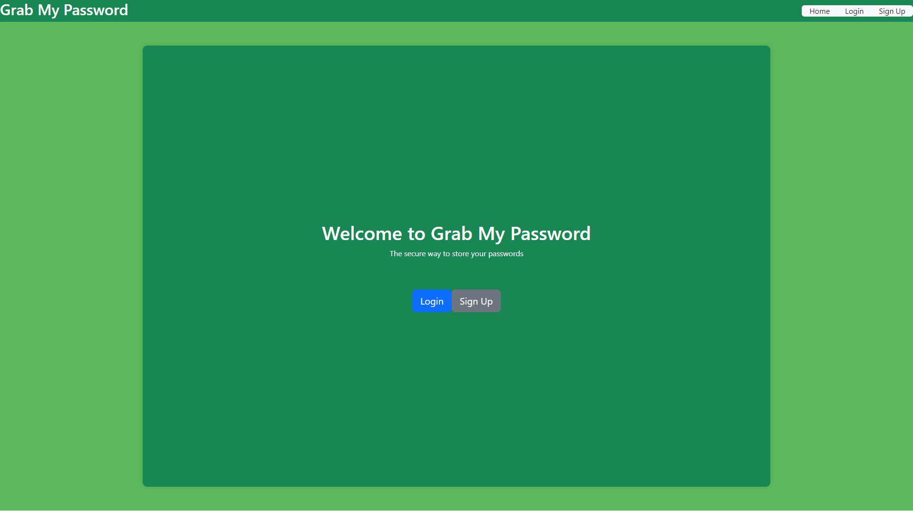

# Grab-My-Password

You can store your password for any website you want. 

## Usage

In our application the user will have the ability to log in and store passwords for their most frequently used websites. 

The following image shows the web application's appearance and functionality:

    

    

## Application

Please click on the [link](https://grab-my-password-23e7faf05060.herokuapp.com/) to visit the Grab-My-Password application. 

## Credits

  * [Kevin Rice] | Github : [DirtyRice901](https://github.com/DirtyRice901)
  * [Ricardo Scuotto] | Github : [Ricky-Sama](https://github.com/Ricky-Sama)
  * [Gavin McNeil] | Github : [gavincmcneil](https://github.com/GavincMcNeil)
  * [Jesse Lare] | Github : [SideControlJS](https://github.com/SideControlJS)
  * [Shamar Melvin] | Github : [DonCod3](https://github.com/DonCod3)